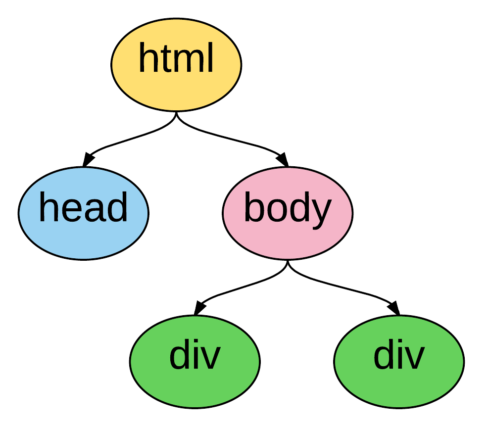

> ## Learning Objectives {.objectives}
>
> * Create your first web page and view it in a browser
> * Understand the structure of an HTML document
> * Understand the different elements within an HTML document

A way of writing that is understood by all web browsers is HTML: 
hypertext markup language. Since we don’t have the ability to do 
logical operations (loops, etc.) with HTML alone, it’s 
not technically a programming language.

Let’s see how we can get our browser to greet the world. 
We need to:

* Create a local folder 'd3_lesson'
* In the folder, create the file 'index.html'
* Open the file with a text editor

Now, if we want to open our new file in a browser, we have to tell it what kind of
file to expect. To do this, we start our file with:

~~~ {.html}
<!DOCTYPE html>
<html>
	--> Everything goes in here <--
</html> 
~~~

Every good webpage consists of a head and a body. 
The header (&lt;head&gt; to open and &lt;/head&gt; to close) normally
contains any meta-data. This could be name of the page or
the inclusion of other files. 

The body (&lt;body&gt; to open and &lt;/body&gt; to close) is where all our content
should go. So everything we type between the brackets will be displayed 
on our page.

~~~ {.html}
<head> 
</head>
<body> 
	Hello world!
</body> 
~~~

Since our web browser understands this language, we can instantly 
open our local index.html file and the browser will interpret our
code as visual components. 

You can view a .html file in your browser by navigating to it in
your file browser and double clicking on it. If you want to use a web browser 
other than your default (we reccomend Chrome or Firefox), open that 
web browser. With that browser as your active window, type `ctrl-o` 
(`cmd-o` on a mac) to bring up a window that will let you navigate to 
your file and click on it to open it.

HTML has more predefined elements that will vary in size and style. 
To divide the page into different sections, we can create a division 
using &lt;div&gt; to open and &lt;/div&gt; to close it. 

~~~ {.html}
<!DOCTYPE html>
<html> 
	<head> 
		--> meta-data (like page title, inclusion of other files) <--
	</head> 
	<body> 
		
Hello world!

		
Hello back!

	</body> 
</html> 
~~~

Behind the scenes, the html is being used to created a heirarchical structure 
of all of the pieces in your webpage. This is called the *Document Object Model
Tree*:

> ## Other elements {.challenge}
>
> Create a folder that contains the file index.html
> What seems to be the difference between &lt;div&gt;, &lt;h1&gt;, and &lt;em&gt;?
> What about the difference between two &lt;div&gt; elements and two &lt;span&gt; elements?
> Create a heading that is in italics. Never be afraid to google to find out how to use certain elements and find out about the syntax!

Useful resources are also the mozilla developer network ([MDN](https://developer.mozilla.org/en-US/)) and [w3school](http://www.w3schools.com). 
